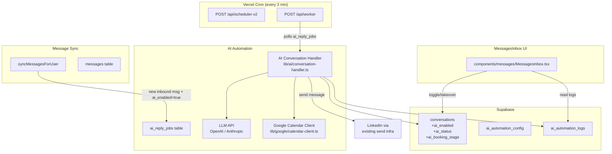
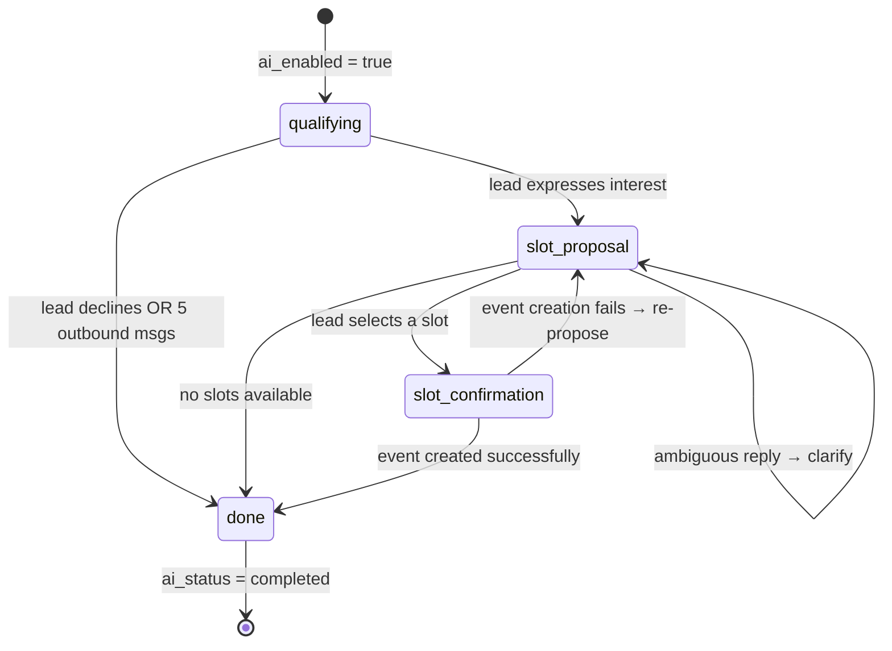

# Design Document: AI Inbox Automation

## Overview

This feature adds an AI-powered inbox automation layer on top of the existing LinkedIn messaging pipeline. When a lead replies to a LinkedIn message and the conversation has automation enabled, an AI agent takes over: it reads the full conversation history and lead context, generates contextual replies via an LLM, qualifies the lead, proposes available Google Calendar time slots, and books a meeting once the lead confirms.

The design extends the existing cron/worker infrastructure (no new job queue technology), adds three new database tables, two new columns on `conversations`, and augments the `MessagesInbox` UI with toggle controls and status indicators. Human takeover is always one click away.

### Key Design Decisions

- **DB-polling job queue** — consistent with the existing `action_queue` pattern; no QStash or external queue needed.
- **Sync-pipeline hook** — the existing `syncMessagesForUser` function is the natural trigger point for enqueuing AI reply jobs; it already detects new inbound messages.
- **LLM as a stateless function** — the AI handler reconstructs full context on every invocation from the DB, making retries safe and idempotent.
- **Google Calendar via server-side OAuth** — refresh tokens stored encrypted in `ai_automation_config`; access tokens are never persisted.
- **Booking flow as a state machine** — the conversation's `ai_booking_stage` column drives which prompt template and action the handler uses.

---

## Architecture



The worker (`POST /api/worker`) is extended to also poll `ai_reply_jobs` on each run. The scheduler (`POST /api/scheduler-v2`) does not need changes — it already runs every 3 minutes and the worker is invoked on the same cadence.

---

## Components and Interfaces

### `lib/ai/conversation-handler.ts`

The core AI processing unit. Called by the worker for each pending `ai_reply_job`.

```typescript
interface AIHandlerInput {
  jobId: string;
  conversationId: string;
  userId: string;
  triggerMessageId: string;
}

interface AIHandlerResult {
  status: 'sent' | 'skipped' | 'error';
  generatedReply?: string;
  errorMessage?: string;
}

export async function processAIReplyJob(
  supabase: SupabaseAdminClient,
  input: AIHandlerInput
): Promise<AIHandlerResult>
```

Internally, `processAIReplyJob` follows this sequence:

1. Fetch conversation + `ai_status` + `ai_booking_stage` — bail if not `active`.
2. Check billing entitlement — skip job if user no longer has paid plan.
3. Fetch full message history (ordered `sent_at ASC`).
4. Fetch lead profile fields.
5. Fetch `ai_automation_config` for persona, objective, meeting duration, timezone.
6. Count outbound AI messages — if ≥ 5 with no interest signal, set `ai_status = completed` and send closing message.
7. Determine current booking stage and select the appropriate prompt template.
8. Call LLM with 30-second timeout.
9. Parse LLM response for booking intent / slot selection / ambiguity signal.
10. If booking stage requires calendar: call `GoogleCalendarClient`.
11. Send reply via existing LinkedIn send infrastructure.
12. Persist message to `messages` table with `metadata.source = 'ai_agent'`.
13. Write to `ai_automation_logs`.
14. Update `conversations.ai_booking_stage` and `ai_status` as needed.

### `lib/google/calendar-client.ts`

```typescript
interface TimeSlot {
  start: string; // ISO 8601
  end: string;   // ISO 8601
  label: string; // human-readable, e.g. "Tuesday 14 Jan at 2:00 PM"
}

interface GoogleCalendarClient {
  getAvailableSlots(params: {
    refreshToken: string;
    durationMinutes: number;
    timezone: string;
    daysAhead?: number; // default 7
  }): Promise<TimeSlot[]>;

  createEvent(params: {
    refreshToken: string;
    title: string;
    description: string;
    slot: TimeSlot;
    organizerEmail: string;
  }): Promise<{ eventId: string; htmlLink: string }>;
}
```

Token refresh is handled internally: the client calls `https://oauth2.googleapis.com/token` with the stored refresh token before each API call. Access tokens are held in memory only for the duration of the request.

### `lib/ai/prompt-builder.ts`

Constructs the LLM prompt from structured inputs. Returns a string. Pure function — no side effects.

```typescript
interface PromptContext {
  persona: string;
  meetingObjective: string;
  lead: LeadContext;
  messageHistory: MessageHistoryItem[];
  bookingStage: BookingStage;
  proposedSlots?: TimeSlot[];
}

export function buildPrompt(ctx: PromptContext): string
```

### `lib/ai/slot-parser.ts`

Parses a lead's free-text reply to identify which proposed slot they selected.

```typescript
export type SlotParseResult =
  | { type: 'selected'; slot: TimeSlot }
  | { type: 'ambiguous' }
  | { type: 'none' };

export function parseSlotSelection(
  leadMessage: string,
  proposedSlots: TimeSlot[]
): SlotParseResult
```

### New API Routes

| Route | Method | Purpose |
|---|---|---|
| `/api/ai-automation/config` | GET | Read user's `ai_automation_config` |
| `/api/ai-automation/config` | PATCH | Update `ai_automation_config` |
| `/api/ai-automation/google/connect` | GET | Initiate Google OAuth flow |
| `/api/ai-automation/google/callback` | GET | Handle OAuth callback, store refresh token |
| `/api/ai-automation/conversations/[id]/toggle` | PATCH | Enable/disable AI for a conversation |
| `/api/ai-automation/conversations/[id]/takeover` | POST | Pause AI, enter takeover mode |
| `/api/ai-automation/conversations/[id]/resume` | POST | Resume AI from paused state |
| `/api/ai-automation/conversations/[id]/logs` | GET | Fetch `ai_automation_logs` for a conversation |

All routes require authenticated session. The toggle/takeover/resume routes also check billing entitlement.

---

## Data Models

### Migration 008: AI Automation Tables

```sql
-- Per-user AI automation configuration
CREATE TABLE ai_automation_config (
  id                    UUID PRIMARY KEY DEFAULT gen_random_uuid(),
  user_id               UUID REFERENCES auth.users(id) ON DELETE CASCADE NOT NULL UNIQUE,
  persona               TEXT NOT NULL DEFAULT '',
  meeting_objective     TEXT NOT NULL DEFAULT '',
  gcal_refresh_token    TEXT,           -- encrypted at rest via Supabase Vault or app-level AES
  gcal_token_error      BOOLEAN NOT NULL DEFAULT FALSE,
  meeting_duration_min  INTEGER NOT NULL DEFAULT 30
                          CHECK (meeting_duration_min >= 15 AND meeting_duration_min <= 120),
  timezone              TEXT NOT NULL DEFAULT 'UTC',
  default_ai_enabled    BOOLEAN NOT NULL DEFAULT FALSE,
  created_at            TIMESTAMPTZ NOT NULL DEFAULT NOW(),
  updated_at            TIMESTAMPTZ NOT NULL DEFAULT NOW()
);

-- Pending AI reply jobs (polled by worker)
CREATE TABLE ai_reply_jobs (
  id                    UUID PRIMARY KEY DEFAULT gen_random_uuid(),
  conversation_id       UUID REFERENCES conversations(id) ON DELETE CASCADE NOT NULL,
  user_id               UUID REFERENCES auth.users(id) ON DELETE CASCADE NOT NULL,
  trigger_message_id    TEXT NOT NULL,  -- external_message_id of the inbound trigger
  status                TEXT NOT NULL DEFAULT 'pending'
                          CHECK (status IN ('pending', 'processing', 'completed', 'failed')),
  retry_count           INTEGER NOT NULL DEFAULT 0,
  execute_at            TIMESTAMPTZ NOT NULL DEFAULT NOW(),
  error_message         TEXT,
  created_at            TIMESTAMPTZ NOT NULL DEFAULT NOW(),
  updated_at            TIMESTAMPTZ NOT NULL DEFAULT NOW(),
  UNIQUE(conversation_id, status) -- partial unique enforced via partial index below
);

-- Partial unique index: at most one pending job per conversation
CREATE UNIQUE INDEX idx_ai_reply_jobs_one_pending
  ON ai_reply_jobs(conversation_id)
  WHERE status = 'pending';

-- Execution audit log
CREATE TABLE ai_automation_logs (
  id                    UUID PRIMARY KEY DEFAULT gen_random_uuid(),
  conversation_id       UUID REFERENCES conversations(id) ON DELETE CASCADE NOT NULL,
  user_id               UUID REFERENCES auth.users(id) ON DELETE CASCADE NOT NULL,
  trigger_message_id    TEXT,
  generated_reply       TEXT,
  status                TEXT NOT NULL CHECK (status IN ('sent', 'skipped', 'error')),
  error_message         TEXT,
  booking_stage         TEXT,
  created_at            TIMESTAMPTZ NOT NULL DEFAULT NOW()
);

-- Indexes
CREATE INDEX idx_ai_reply_jobs_status_execute ON ai_reply_jobs(status, execute_at)
  WHERE status = 'pending';
CREATE INDEX idx_ai_reply_jobs_conversation ON ai_reply_jobs(conversation_id);
CREATE INDEX idx_ai_automation_logs_conversation ON ai_automation_logs(conversation_id);
CREATE INDEX idx_ai_automation_config_user ON ai_automation_config(user_id);

-- RLS
ALTER TABLE ai_automation_config ENABLE ROW LEVEL SECURITY;
ALTER TABLE ai_reply_jobs ENABLE ROW LEVEL SECURITY;
ALTER TABLE ai_automation_logs ENABLE ROW LEVEL SECURITY;

CREATE POLICY "Users manage own ai_automation_config" ON ai_automation_config
  FOR ALL USING (auth.uid() = user_id);
CREATE POLICY "Service role full access ai_automation_config" ON ai_automation_config
  FOR ALL TO service_role USING (true);

CREATE POLICY "Users view own ai_reply_jobs" ON ai_reply_jobs
  FOR SELECT USING (auth.uid() = user_id);
CREATE POLICY "Service role full access ai_reply_jobs" ON ai_reply_jobs
  FOR ALL TO service_role USING (true);

CREATE POLICY "Users view own ai_automation_logs" ON ai_automation_logs
  FOR SELECT USING (auth.uid() = user_id);
CREATE POLICY "Service role full access ai_automation_logs" ON ai_automation_logs
  FOR ALL TO service_role USING (true);
```

### Migration 009: Conversations Table Extensions

```sql
ALTER TABLE conversations
  ADD COLUMN IF NOT EXISTS ai_enabled       BOOLEAN NOT NULL DEFAULT FALSE,
  ADD COLUMN IF NOT EXISTS ai_status        TEXT NOT NULL DEFAULT 'idle'
    CHECK (ai_status IN ('idle', 'active', 'paused', 'completed', 'error')),
  ADD COLUMN IF NOT EXISTS ai_booking_stage TEXT NOT NULL DEFAULT 'qualifying'
    CHECK (ai_booking_stage IN ('qualifying', 'slot_proposal', 'slot_confirmation', 'done'));

CREATE INDEX IF NOT EXISTS idx_conversations_ai_status
  ON conversations(ai_status) WHERE ai_enabled = TRUE;
```

### Booking Stage State Machine



### Updated TypeScript Types (`types/index.ts` additions)

```typescript
export type AIStatus = 'idle' | 'active' | 'paused' | 'completed' | 'error';
export type AIBookingStage = 'qualifying' | 'slot_proposal' | 'slot_confirmation' | 'done';
export type AIJobStatus = 'pending' | 'processing' | 'completed' | 'failed';
export type AILogStatus = 'sent' | 'skipped' | 'error';

export interface AIAutomationConfig {
  id: string;
  user_id: string;
  persona: string;
  meeting_objective: string;
  gcal_refresh_token: string | null;
  gcal_token_error: boolean;
  meeting_duration_min: number;
  timezone: string;
  default_ai_enabled: boolean;
  created_at: string;
  updated_at: string;
}

export interface AIReplyJob {
  id: string;
  conversation_id: string;
  user_id: string;
  trigger_message_id: string;
  status: AIJobStatus;
  retry_count: number;
  execute_at: string;
  error_message?: string;
  created_at: string;
}

export interface AIAutomationLog {
  id: string;
  conversation_id: string;
  user_id: string;
  trigger_message_id?: string;
  generated_reply?: string;
  status: AILogStatus;
  error_message?: string;
  booking_stage?: string;
  created_at: string;
}
```

---

## Correctness Properties

*A property is a characteristic or behavior that should hold true across all valid executions of a system — essentially, a formal statement about what the system should do. Properties serve as the bridge between human-readable specifications and machine-verifiable correctness guarantees.*

### Property 1: Config round-trip preserves all fields

*For any* valid `AIAutomationConfig` object written to the database, reading it back should produce an object with identical values for all required fields (`persona`, `meeting_objective`, `meeting_duration_min`, `timezone`, `default_ai_enabled`, `gcal_token_error`).

**Validates: Requirements 1.1**

---

### Property 2: Meeting duration validation is a closed interval

*For any* integer `d`, the meeting duration validator should accept `d` if and only if `15 <= d <= 120`. Values outside this range (including 14, 121, 0, negative numbers, and very large numbers) must be rejected.

**Validates: Requirements 1.2**

---

### Property 3: AI enable sets correct initial status

*For any* conversation, when `ai_enabled` is set to `true`, the resulting `ai_status` should be `'active'` if the conversation has at least one inbound message, and `'idle'` otherwise. This property holds regardless of the conversation's prior state.

**Validates: Requirements 2.2**

---

### Property 4: AI message indicator is always present for AI-sourced messages

*For any* message record where `metadata.source === 'ai_agent'`, the `MessagesInbox` message bubble renderer should include an AI indicator element. This should hold for any message content, any sender name, and any conversation state.

**Validates: Requirements 2.5, 4.7**

---

### Property 5: Inbound trigger creates exactly one pending job for active conversations

*For any* inbound message inserted into a conversation where `ai_enabled = true` and `ai_status = 'active'`, exactly one `ai_reply_job` record with `status = 'pending'` should exist for that conversation after the trigger. Inserting multiple inbound messages in rapid succession should still result in at most one pending job (deduplication invariant).

**Validates: Requirements 3.1, 3.4**

---

### Property 6: Job record contains all required fields

*For any* valid trigger event (inbound message in an active AI conversation), the created `ai_reply_job` record should contain non-null values for `conversation_id`, `user_id`, `trigger_message_id`, `status = 'pending'`, `retry_count = 0`, and `created_at`.

**Validates: Requirements 3.2**

---

### Property 7: No job created for paused or completed conversations

*For any* inbound message inserted into a conversation where `ai_status` is `'paused'` or `'completed'`, no `ai_reply_job` record should be created. This holds regardless of the value of `ai_enabled`.

**Validates: Requirements 3.3, 8.4**

---

### Property 8: Message history is always sorted ascending by sent_at

*For any* conversation with N messages stored in arbitrary insertion order, the message history returned by the AI handler's fetch function should be sorted strictly ascending by `sent_at`. This is required for the LLM to receive a coherent conversation thread.

**Validates: Requirements 4.1**

---

### Property 9: Prompt contains all required context components

*For any* combination of `persona` string, `meetingObjective` string, `LeadContext` object, and `MessageHistoryItem[]` array, the string returned by `buildPrompt()` should contain all four components. Specifically: the persona text, the meeting objective text, the lead's name, and at least the content of the most recent message.

**Validates: Requirements 4.4**

---

### Property 10: AI reply is stored with correct metadata source

*For any* AI-generated reply that is successfully sent, the corresponding record inserted into the `messages` table should have `metadata.source === 'ai_agent'`. This holds regardless of message content, conversation state, or booking stage.

**Validates: Requirements 4.7**

---

### Property 11: Booking flow not triggered without interest signal

*For any* conversation in the `qualifying` booking stage, the `ai_booking_stage` should never advance to `slot_proposal` unless the LLM has returned a positive interest signal from at least one inbound message. Conversations with zero inbound messages or only disinterest signals should remain in `qualifying`.

**Validates: Requirements 5.4**

---

### Property 12: Agent stops after 5 outbound messages without interest

*For any* conversation where the AI has sent N ≥ 5 outbound messages (with `metadata.source = 'ai_agent'`) and no inbound message has triggered a positive interest signal, the `ai_status` should be `'completed'` and no further `ai_reply_jobs` should be enqueued for that conversation.

**Validates: Requirements 5.5**

---

### Property 13: Free/busy query always spans exactly 7 days

*For any* current timestamp `T`, the time range passed to the Google Calendar free/busy API should be `[T, T + 7 days]`. This holds regardless of the day of the week, timezone, or DST transitions.

**Validates: Requirements 6.2**

---

### Property 14: All returned slots respect duration and business hours

*For any* free/busy calendar response and any configured meeting duration `D` (where `15 <= D <= 120`), every slot returned by `getAvailableSlots()` should have a duration of exactly `D` minutes, a start time no earlier than 08:00 in the configured timezone, and an end time no later than 18:00 in the configured timezone.

**Validates: Requirements 6.3**

---

### Property 15: Slot proposal count is at most 3

*For any* list of available slots (including lists with more than 3 entries), the number of slots included in the proposal message sent to the lead should be at most 3.

**Validates: Requirements 6.4**

---

### Property 16: Unambiguous slot selection is always parsed correctly

*For any* list of proposed slots and any lead reply message that unambiguously references exactly one slot (by ordinal, time, or date), `parseSlotSelection()` should return `{ type: 'selected', slot: <the referenced slot> }`. For messages that reference zero or multiple slots, it should return `{ type: 'ambiguous' }` or `{ type: 'none' }`.

**Validates: Requirements 7.1, 7.6**

---

### Property 17: Calendar event payload contains all required fields

*For any* identified `TimeSlot` and any `LeadContext`, the event creation payload passed to the Google Calendar API should include: a non-empty `title`, the lead's name in the `description`, the lead's LinkedIn URL in the `description`, `start` equal to `slot.start`, `end` equal to `slot.end`, and a non-empty `organizerEmail`.

**Validates: Requirements 7.2**

---

### Property 18: Confirmation message contains date, time, and next steps

*For any* successfully created calendar event, the confirmation message string generated by the AI handler should contain the meeting date, the meeting time, and a non-empty next-steps summary. This holds regardless of the slot's date, time, or timezone.

**Validates: Requirements 7.3**

---

### Property 19: Subscription downgrade pauses all active AI conversations

*For any* user with N conversations where `ai_status = 'active'`, when that user's subscription transitions to `inactive` or `canceled`, all N conversations should have `ai_status = 'paused'` after the transition handler runs. No active AI conversations should remain.

**Validates: Requirements 9.3**

---

### Property 20: Retry backoff follows 2^retry_count schedule

*For any* failed `ai_reply_job` with `retry_count = N` where `N < 3`, the `execute_at` timestamp on the rescheduled job should be approximately `2^N` minutes after the failure time (within a 1-second tolerance). When `retry_count` reaches 3, `ai_status` on the conversation should be set to `'error'`.

**Validates: Requirements 10.4**

---

### Property 21: Execution log always written for every job attempt

*For any* `ai_reply_job` execution (whether the result is `sent`, `skipped`, or `error`), exactly one record should be inserted into `ai_automation_logs` with non-null `conversation_id`, `user_id`, `status`, and `created_at`.

**Validates: Requirements 10.1**

---

### Property 22: Resuming AI does not retroactively process paused-period messages

*For any* conversation that was paused at time `T_pause` and resumed at time `T_resume`, no `ai_reply_job` should be created for inbound messages with `sent_at` between `T_pause` and `T_resume`. Only inbound messages arriving after `T_resume` should trigger new jobs.

**Validates: Requirements 8.5**

---

## Error Handling

### LLM Errors
- Timeout after 30 seconds → set `ai_status = 'error'`, log to `ai_automation_logs`, increment `retry_count`.
- Non-retryable errors (e.g., content policy violation) → set `ai_status = 'error'` immediately, do not retry.
- Retryable errors (rate limit, 5xx) → increment `retry_count`, reschedule with exponential backoff.

### Google Calendar Errors
- Token refresh failure → set `ai_status = 'error'`, set `gcal_token_error = true` on `ai_automation_config` to surface in UI.
- Event creation failure → do not set error status; instead re-propose the same slots (recoverable path per Requirement 7.5).
- No available slots → send "no availability" message, keep `ai_status = 'active'` (lead may check back).

### Worker Errors
- Distributed lock via `lib/redis/lock-manager.ts` prevents duplicate job execution across concurrent cron runs. Lock key: `ai_reply_job:{jobId}`, TTL 5 minutes.
- If the worker crashes mid-job, the job remains in `processing` status. A cleanup pass (run at worker startup) resets jobs stuck in `processing` for > 10 minutes back to `pending`.

### Billing Entitlement Errors
- Checked at job execution time. If the user's subscription is no longer active, the job is marked `skipped` (not `failed`) and logged. No retry.

### Manual Takeover Race Condition
- When a user sends a manual message, the API route atomically sets `ai_status = 'paused'` and cancels any pending job (`UPDATE ai_reply_jobs SET status = 'failed' WHERE conversation_id = ? AND status = 'pending'`) in a single transaction before sending the message. This prevents the AI from sending a reply after the user has taken over.

---

## Testing Strategy

### Unit Tests (example-based)

- `lib/ai/prompt-builder.ts` — verify prompt contains all required sections for known inputs.
- `lib/ai/slot-parser.ts` — verify correct parsing for clear selections, ambiguous replies, and no-match cases.
- `lib/google/calendar-client.ts` — mock OAuth and Calendar API; verify token refresh, slot filtering, event payload construction.
- API routes — verify auth enforcement, request validation, and correct DB mutations using Supabase mock.
- Billing gate — verify free plan rejection and paid plan acceptance.

### Property-Based Tests

Using [fast-check](https://github.com/dubzzz/fast-check) (TypeScript-native PBT library). Each property test runs a minimum of 100 iterations.

Each test is tagged with a comment referencing the design property:
```
// Feature: ai-inbox-automation, Property N: <property_text>
```

Properties to implement as property-based tests:

| Property | Test Target | Generator |
|---|---|---|
| P2: Duration validation | `validateMeetingDuration(d)` | `fc.integer()` |
| P3: AI enable sets correct status | `setAIEnabled()` toggle logic | `fc.record({ hasInbound: fc.boolean() })` |
| P5: One pending job per conversation | `enqueueTrigger()` | `fc.array(fc.string(), { minLength: 1 })` (multiple trigger events) |
| P8: Message history sorted ascending | `fetchMessageHistory()` | `fc.array(fc.record({ sent_at: fc.date() }))` |
| P9: Prompt contains all components | `buildPrompt()` | `fc.record({ persona: fc.string(), objective: fc.string(), lead: leadArb, history: fc.array(msgArb) })` |
| P12: Agent stops at 5 outbound | `shouldContinueConversation()` | `fc.integer({ min: 0, max: 10 })` (outbound count) |
| P13: Free/busy query spans 7 days | `buildFreeBusyQuery()` | `fc.date()` |
| P14: Slots respect duration and hours | `getAvailableSlots()` with mock | `fc.record({ duration: fc.integer({ min: 15, max: 120 }), freeBusy: freeBusyArb })` |
| P15: Slot proposal ≤ 3 | `buildSlotProposalMessage()` | `fc.array(slotArb, { minLength: 0, maxLength: 20 })` |
| P16: Slot parser correctness | `parseSlotSelection()` | `fc.tuple(fc.array(slotArb, { minLength: 1, maxLength: 3 }), fc.string())` |
| P20: Retry backoff schedule | `computeNextExecuteAt()` | `fc.integer({ min: 0, max: 2 })` (retry_count) |

### Integration Tests

- End-to-end job flow: sync pipeline → job enqueue → worker pickup → LLM mock → message sent.
- Google Calendar OAuth: mock token endpoint, verify access token is fetched and not persisted.
- Subscription downgrade: verify all active AI conversations are paused when subscription webhook fires.

### UI Component Tests

- `MessagesInbox` with `ai_status` variants: verify toggle, "Take over" button, "Resume AI" button, error indicator, and AI message badge render correctly for each status value.
