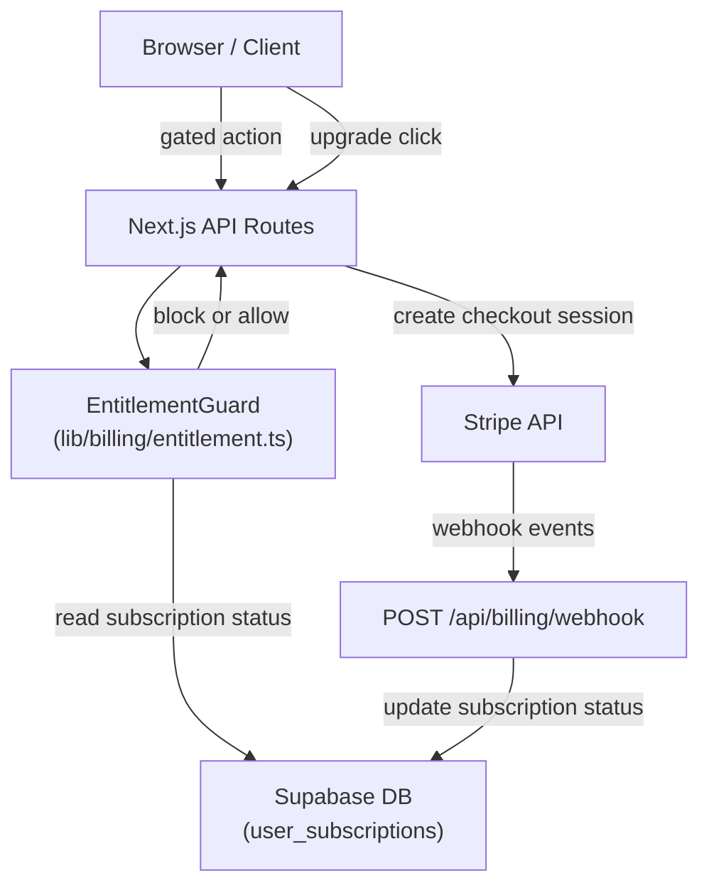
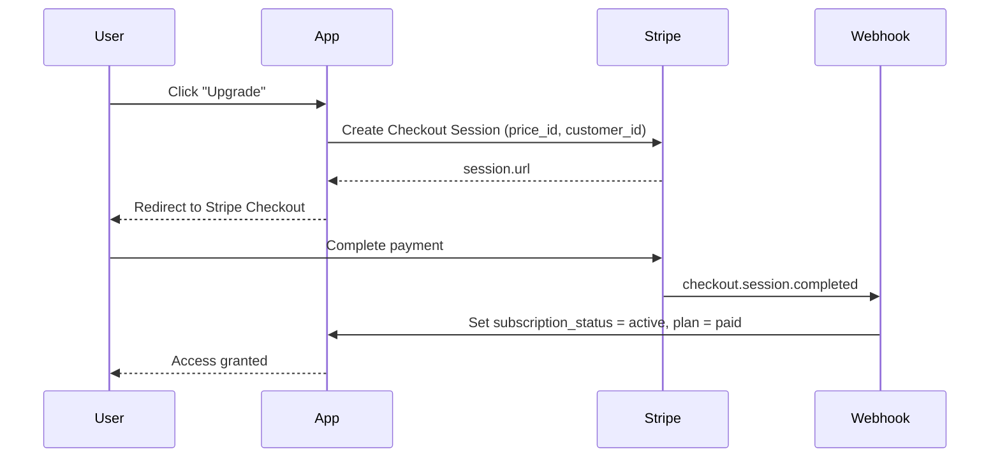

# Design Document: Pricing & Billing

## Overview

This document describes the architecture for a Stripe-based subscription billing system integrated into the existing Next.js + Supabase application. The system enforces free/paid plan entitlements, tracks peak LinkedIn account usage per billing cycle to prevent abuse, and uses Stripe webhooks as the authoritative source of truth for subscription state.

The existing app has no billing infrastructure. We will add:
- A `user_subscriptions` table to track plan state and usage counters
- A server-side `EntitlementGuard` utility used by all gated API routes
- Stripe Checkout for upgrades and a webhook handler for status sync
- A billing UI card in the existing Settings page

---

## Architecture



---

## Components and Interfaces

### 1. EntitlementGuard (`lib/billing/entitlement.ts`)

Central server-side utility. All gated API routes call this before executing.

```typescript
type EntitlementResult =
  | { allowed: true }
  | { allowed: false; reason: string; upgrade_required: boolean };

async function checkCampaignCreate(userId: string): Promise<EntitlementResult>
async function checkLeadUpload(userId: string, newLeadCount: number): Promise<EntitlementResult>
async function checkAccountConnect(userId: string): Promise<EntitlementResult>
async function getSubscription(userId: string): Promise<UserSubscription>
async function updateAccountCounters(userId: string, delta: 1 | -1): Promise<void>
```

### 2. Billing API Routes

| Route | Method | Purpose |
|---|---|---|
| `/api/billing/checkout` | POST | Create Stripe Checkout Session |
| `/api/billing/portal` | POST | Create Stripe Customer Portal session |
| `/api/billing/webhook` | POST | Handle Stripe webhook events |
| `/api/billing/status` | GET | Return current subscription + usage for UI |

### 3. Stripe Webhook Handler (`app/api/billing/webhook/route.ts`)

Handles these Stripe events:
- `checkout.session.completed` → activate subscription
- `customer.subscription.updated` → sync status
- `customer.subscription.deleted` → set canceled
- `invoice.paid` → confirm active, record payment
- `invoice.payment_failed` → set past_due, record grace period start

### 4. Billing UI (`BillingSection` in `app/dashboard/settings/page.tsx`)

Replaces the current static `BillingSection` with live data from `/api/billing/status`.

### 5. Upgrade Modal (`components/billing/UpgradeModal.tsx`)

Shown when any entitlement check fails. Accepts a `reason` prop and estimated charge.

---

## Data Models

### New Table: `user_subscriptions`

```sql
CREATE TABLE user_subscriptions (
  user_id UUID PRIMARY KEY REFERENCES auth.users(id) ON DELETE CASCADE,
  
  -- Plan state
  plan TEXT NOT NULL DEFAULT 'free' CHECK (plan IN ('free', 'paid')),
  subscription_status TEXT NOT NULL DEFAULT 'inactive'
    CHECK (subscription_status IN ('inactive', 'active', 'past_due', 'canceled')),
  
  -- Stripe references
  stripe_customer_id TEXT,
  stripe_subscription_id TEXT,
  
  -- Billing cycle tracking
  current_period_start TIMESTAMPTZ,
  current_period_end TIMESTAMPTZ,
  
  -- Account usage counters (anti-abuse)
  current_accounts INTEGER NOT NULL DEFAULT 0,
  peak_accounts INTEGER NOT NULL DEFAULT 0,
  
  -- Grace period
  grace_period_ends_at TIMESTAMPTZ,
  
  -- Timestamps
  created_at TIMESTAMPTZ NOT NULL DEFAULT NOW(),
  updated_at TIMESTAMPTZ NOT NULL DEFAULT NOW()
);
```

### TypeScript Types (`types/index.ts` additions)

```typescript
export type PlanType = 'free' | 'paid';
export type SubscriptionStatus = 'inactive' | 'active' | 'past_due' | 'canceled';

export interface UserSubscription {
  user_id: string;
  plan: PlanType;
  subscription_status: SubscriptionStatus;
  stripe_customer_id?: string;
  stripe_subscription_id?: string;
  current_period_start?: string;
  current_period_end?: string;
  current_accounts: number;
  peak_accounts: number;
  grace_period_ends_at?: string;
  created_at: string;
  updated_at: string;
}

export interface EntitlementError {
  allowed: false;
  reason: string;
  upgrade_required: boolean;
  estimated_monthly_cost?: number;
}

export interface BillingStatus {
  plan: PlanType;
  subscription_status: SubscriptionStatus;
  current_accounts: number;
  peak_accounts: number;
  estimated_next_invoice: number;
  grace_period_ends_at?: string;
  current_period_end?: string;
}
```

### Pricing Constants (`lib/billing/constants.ts`)

```typescript
export const FREE_PLAN_LIMITS = {
  MAX_CAMPAIGNS: 1,
  MAX_LEADS: 50,
  MAX_ACCOUNTS: 1,
} as const;

export const PAID_PLAN_PRICING = {
  PRICE_PER_EXTRA_ACCOUNT: 10, // USD per billing cycle
  BASE_ACCOUNTS_INCLUDED: 1,
} as const;

export const GRACE_PERIOD_DAYS = 3;
```

---

## Entitlement Logic

### Is User Effectively Paid?

A user is treated as paid (full access) if:
- `subscription_status === 'active'`
- OR `subscription_status === 'past_due'` AND `grace_period_ends_at > NOW()`

A user is treated as free (restricted) if:
- `plan === 'free'`
- OR `subscription_status === 'canceled'`
- OR `subscription_status === 'past_due'` AND grace period has expired

### Campaign Create Guard

```
if user is free:
  count = SELECT COUNT(*) FROM campaigns WHERE user_id = ?
  if count >= 1: block with upgrade_required
```

### Lead Upload Guard

```
if user is free:
  total = SELECT COUNT(*) FROM leads WHERE campaign_id IN (user's campaigns)
  if total + new_count > 50: block with upgrade_required
```

### Account Connect Guard

```
current = subscription.current_accounts
if user is free AND current >= 1: block with upgrade_required
if user is paid:
  new_current = current + 1
  new_peak = max(peak_accounts, new_current)
  UPDATE user_subscriptions SET current_accounts = new_current, peak_accounts = new_peak
```

### Account Disconnect

```
new_current = max(0, current_accounts - 1)
UPDATE user_subscriptions SET current_accounts = new_current
-- peak_accounts is NOT updated (anti-abuse)
```

### Estimated Invoice Calculation

```
extra_accounts = max(0, peak_accounts - 1)
estimated = extra_accounts * $10
```

---

## Billing Lifecycle

### Upgrade Flow



### Cycle End / Invoice

At end of billing cycle, Stripe generates an invoice. The quantity on the subscription item is updated to `max(0, peak_accounts - 1)` before the invoice is finalized. On `invoice.paid` webhook, we reset `peak_accounts = current_accounts` for the new cycle.

### Subscription Item Quantity Updates

When `current_accounts` changes, we update the Stripe subscription item quantity to reflect the current extra accounts. This ensures Stripe always has the right quantity for proration and invoicing.

```
stripe.subscriptions.update(subscription_id, {
  items: [{ id: item_id, quantity: max(0, current_accounts - 1) }]
})
```

However, for peak-based billing, we track `peak_accounts` in our DB and update the Stripe quantity to `peak_accounts - 1` at invoice time (via `invoice.upcoming` webhook or a scheduled job).

---

## Correctness Properties

*A property is a characteristic or behavior that should hold true across all valid executions of a system — essentially, a formal statement about what the system should do. Properties serve as the bridge between human-readable specifications and machine-verifiable correctness guarantees.*

### Property 1: Free plan campaign limit

*For any* free user, the number of campaigns they can successfully create is at most 1. Any attempt to create a second campaign must be blocked with `upgrade_required: true`.

**Validates: Requirements 1.1, 1.4**

---

### Property 2: Free plan lead limit

*For any* free user and any batch of leads, if adding those leads would cause the user's total lead count to exceed 50, the upload must be blocked with `upgrade_required: true`. The total lead count must remain unchanged after a blocked upload.

**Validates: Requirements 1.2, 1.5**

---

### Property 3: Free plan account limit

*For any* free user who already has 1 connected account, any attempt to connect an additional account must be blocked with `upgrade_required: true`.

**Validates: Requirements 1.3, 1.6**

---

### Property 4: Peak accounts never decreases within a cycle

*For any* user subscription, after any sequence of account connect and disconnect operations within the same billing cycle, `peak_accounts` must be greater than or equal to its value before the sequence began. Disconnecting accounts must never reduce `peak_accounts`.

**Validates: Requirements 2.3, 2.4, 3.1**

---

### Property 5: Peak accounts tracks the maximum

*For any* sequence of account connect operations, `peak_accounts` must equal the maximum value that `current_accounts` reached during that sequence.

**Validates: Requirements 2.3, 3.1**

---

### Property 6: Billing amount is peak-based

*For any* user subscription, the estimated invoice amount must equal `max(0, peak_accounts - 1) * 10`. This must hold regardless of the current value of `current_accounts`.

**Validates: Requirements 2.1, 2.2, 2.5**

---

### Property 7: Grace period allows existing automation

*For any* user whose subscription is `past_due` and whose `grace_period_ends_at` is in the future, entitlement checks for existing automation must return `allowed: true`.

**Validates: Requirements 5.1, 5.2**

---

### Property 8: Expired grace period enforces free limits

*For any* user whose subscription is `past_due` and whose `grace_period_ends_at` is in the past, entitlement checks for new campaigns, lead uploads, and extra account connections must return `allowed: false` with `upgrade_required: true`.

**Validates: Requirements 5.3, 8.4**

---

### Property 9: Webhook is the only status mutator

*For any* subscription status value in the database, that value must only have been set by a verified Stripe webhook handler. No client-side request or non-webhook API call may directly set `subscription_status`.

**Validates: Requirements 6.1, 6.6**

---

### Property 10: Cycle reset preserves current accounts

*For any* billing cycle transition (triggered by `invoice.paid`), after the reset, `peak_accounts` must equal the value of `current_accounts` at the moment of the reset. No accounts are added or removed by the reset itself.

**Validates: Requirements 2.6, 4.4**

---

## Error Handling

| Scenario | Behavior |
|---|---|
| Entitlement check fails | Return `{ error: 'upgrade_required', reason: '...', upgrade_required: true }` with HTTP 403 |
| Stripe webhook signature invalid | Return 400, log warning, do not update DB |
| Stripe API call fails during checkout | Return 500, surface error to user |
| `user_subscriptions` row missing | Auto-create with `plan: 'free'` defaults on first access |
| Grace period expires mid-session | Next API call will enforce free limits; no real-time push needed |

---

## Testing Strategy

### Unit Tests

- `EntitlementGuard` functions with mocked Supabase responses
- Billing constant calculations (estimated invoice, extra account count)
- Grace period expiry logic (date comparison)
- Webhook event handler for each Stripe event type

### Property-Based Tests

Using **fast-check** (already compatible with the TypeScript/Node stack, no new test runner needed).

Each property test runs a minimum of 100 iterations.

Tag format: `// Feature: pricing-billing, Property N: <property_text>`

| Property | Test Description |
|---|---|
| P1 | Generate free users with 0–5 campaigns; verify create is blocked at count >= 1 |
| P2 | Generate free users with 0–60 leads; verify upload blocked when total would exceed 50 |
| P3 | Generate free users with 0–3 accounts; verify connect blocked at count >= 1 |
| P4 | Generate random connect/disconnect sequences; verify peak never decreases |
| P5 | Generate connect sequences; verify peak equals max of current_accounts history |
| P6 | Generate arbitrary peak_accounts values; verify invoice = max(0, peak-1) * 10 |
| P7 | Generate past_due subscriptions with future grace; verify automation allowed |
| P8 | Generate past_due subscriptions with expired grace; verify new actions blocked |
| P10 | Generate cycle transitions; verify peak resets to current_accounts |

### Integration Tests (Examples)

- Full upgrade flow: checkout → webhook → status active
- Account connect on paid plan updates both counters correctly
- Account disconnect does not reduce peak
- Webhook with invalid signature is rejected
