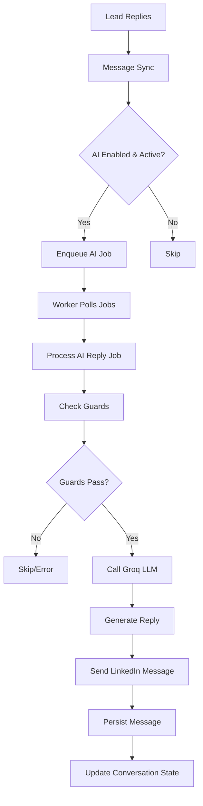

# AI Message Sending Feature Documentation

## Overview

The AI Message Sending feature automatically responds to LinkedIn messages when leads reply to conversations. It integrates with the existing LinkedIn messaging pipeline, Google Calendar for meeting booking, and uses Groq LLM for generating contextual replies.

## Architecture

```
Lead replies on LinkedIn
  ↓ (sync every 1 min)
Message Sync Pipeline
  ↓ (detects new inbound message)
AI Reply Job Enqueued
  ↓ (worker polls every 30 sec)
Worker Processes Job
  ↓ (calls conversation handler)
AI Conversation Handler
  ↓ (calls Groq LLM)
Generated Reply
  ↓ (sends via LinkedIn API)
Message Sent & Persisted
```

## Core Components

### 1. Database Schema
- **`ai_automation_config`** - Per-user AI settings (persona, meeting objective, Google Calendar tokens)
- **`ai_reply_jobs`** - Pending AI reply jobs queue
- **`ai_automation_logs`** - Execution audit trail
- **`conversations`** - Extended with `ai_enabled`, `ai_status`, `ai_booking_stage` columns

### 2. Key Files
- **`lib/ai/conversation-handler.ts`** - Core AI processing logic
- **`lib/ai/prompt-builder.ts`** - LLM prompt construction
- **`lib/ai/slot-parser.ts`** - Calendar slot selection parsing
- **`lib/google/calendar-client.ts`** - Google Calendar integration
- **`lib/linkedin/message-sync.ts`** - Message sync with AI job enqueue logic
- **`app/api/worker/route.ts`** - Job processing worker
- **`app/api/ai-automation/conversations/[id]/toggle/route.ts`** - AI toggle control

### 3. UI Components
- **`components/messages/MessagesInbox.tsx`** - AI toggle, status indicators, control buttons

## Flow Diagram



## Implementation Issues & Resolutions

### Issue 1: Jobs Not Being Enqueued
**Problem**: AI reply jobs weren't being created when leads replied.

**Root Cause**: Multiple issues:
1. Conversations API filtered out replied leads with `.eq('leads.status', 'message_sent')`
2. AI job enqueue only triggered on newly inserted messages, not existing ones
3. Toggle route required Google Calendar connection before enabling AI

**Resolution**:
```typescript
// Removed lead status filter from conversations API
.eq('id', conversationId)
.eq('user_id', user.id)
// .eq('leads.status', 'message_sent') ← REMOVED

// Added immediate job enqueue when toggle is turned ON
if (newStatus === 'active') {
  const { data: lastInbound } = await supabase
    .from('messages')
    .select('external_message_id')
    .eq('conversation_id', conversationId)
    .eq('direction', 'inbound')
    .order('sent_at', { ascending: false })
    .limit(1)
    .maybeSingle();

  if (lastInbound) {
    await adminSupabase.from('ai_reply_jobs').insert({...});
  }
}
```

### Issue 2: Worker Not Processing AI Jobs
**Problem**: Worker returned "No actions ready" even with pending AI jobs.

**Root Cause**: Worker checked `action_queue` first and returned early if empty, never reaching AI jobs processing.

**Resolution**:
```typescript
// Moved AI job processing BEFORE early return check
// ── AI Reply Jobs (process regardless of action_queue status)
const { data: pendingAIJobs } = await supabase
  .from('ai_reply_jobs')
  .select('id, conversation_id, user_id, trigger_message_id')
  .eq('status', 'pending')
  .lte('execute_at', currentTime.toISOString())
  .order('execute_at', { ascending: true })
  .limit(10);

// Process AI jobs first, then check action_queue
```

### Issue 3: Row Level Security (RLS) Policy Violation
**Problem**: `new row violates row-level security policy for table "ai_reply_jobs"`

**Root Cause**: Toggle route used user-level Supabase client, but RLS policy only allowed service role to insert AI jobs.

**Resolution**:
```typescript
// Use admin client for AI job insertion
const adminSupabase = createAdminClient();
const { error: insertError } = await adminSupabase
  .from('ai_reply_jobs')
  .insert({...});
```

### Issue 4: Upsert Conflict Specification Error
**Problem**: `there is no unique or exclusion constraint matching the ON CONFLICT specification`

**Root Cause**: `ai_reply_jobs` table has partial unique index `idx_ai_reply_jobs_one_pending` (WHERE status = 'pending'), but Supabase upsert needs regular unique constraint.

**Resolution**:
```typescript
// Use plain insert with duplicate error handling instead of upsert
const { error: insertError } = await supabase
  .from('ai_reply_jobs')
  .insert({...});

if (insertError?.code === '23505') {
  console.log('AI job already pending, skipping');
} else if (insertError) {
  console.error('Failed to enqueue AI job:', insertError.message);
} else {
  console.log('AI reply job enqueued successfully');
}
```

### Issue 5: Redis Configuration Missing
**Problem**: `The 'url' property is missing or undefined in your Redis config`

**Root Cause**: `UPSTASH_REDIS_REST_URL` and `UPSTASH_REDIS_REST_TOKEN` not configured.

**Resolution**:
1. Sign up at [console.upstash.com](https://console.upstash.com)
2. Create Redis database
3. Add to `.env`:
```bash
UPSTASH_REDIS_REST_URL=https://xxx.upstash.io
UPSTASH_REDIS_REST_TOKEN=xxx
```

### Issue 6: Manual Send Route 404 Error
**Problem**: `POST /api/messages/send 404` when sending manual messages.

**Root Cause**: Same lead status filter issue - send route also filtered `.eq('leads.status', 'message_sent')`.

**Resolution**:
```typescript
// Removed lead status filter from send route
.eq('id', conversationId)
.eq('user_id', user.id)
// .eq('leads.status', 'message_sent') ← REMOVED
.single();
```

### Issue 7: Unread Count Not Updating Correctly
**Problem**: Unread badges reappeared after being cleared when opening conversations.

**Root Cause**: Message sync overwrote locally-zeroed `unread_count` with LinkedIn's API value.

**Resolution**:
```typescript
// Only update unread_count if it's increasing (new messages)
await supabase.from('conversations').update({
  ...(parsed.unreadCount > (local.unread_count ?? 0) 
    ? { unread_count: parsed.unreadCount } 
    : {}),
  last_message_at: parsed.lastMessageAt ?? local.last_message_at,
  last_external_message_id: parsed.lastMessageUrn,
});
```

### Issue 8: Cron Runner Environment Variables
**Problem**: Cron runner couldn't read `.env` files, always used default `localhost:3000`.

**Root Cause**: `cron-runner.mjs` is plain Node.js script without dotenv loading.

**Resolution**:
```javascript
// Added dotenv loading to cron runner
import { config } from 'dotenv';

config({ path: '.env.local' });
config({ path: '.env' });

const BASE_URL = process.env.NEXT_PUBLIC_APP_URL || 'http://localhost:3000';
```

## Message Sync Conflicts & Interactions

### No Direct Conflicts
The AI message sending feature is designed to work **alongside** the message sync job without conflicts:

1. **Separate Tables**: AI jobs use `ai_reply_jobs` table, sync uses `messages` and `conversations`
2. **Different Timing**: Sync runs every 1 minute, worker processes jobs every 30 seconds
3. **Complementary Functions**: Sync detects new messages → AI generates replies → Sync picks up AI-sent messages

### Positive Interactions

1. **Job Enqueue Trigger**: Message sync detects new inbound messages and enqueues AI jobs
2. **Message Persistence**: AI-sent messages are persisted via same infrastructure as manual sends
3. **Status Updates**: Both systems update conversation metadata (last_message_at, etc.)

### Coordination Points

1. **Unread Count Management**: 
   - Sync updates from LinkedIn API
   - UI resets to 0 when opened
   - Sync respects local resets (doesn't overwrite 0 → positive)

2. **Lead Status Updates**:
   - Sync sets lead status to 'replied' on inbound messages
   - AI completion can set lead status to 'completed'
   - No conflicts - different lifecycle stages

3. **Conversation State**:
   - Sync updates `last_message_at` and `last_external_message_id`
   - AI handler also updates these fields after sending
   - No conflicts - both use same timestamp/ID format

## Environment Variables Required

```bash
# ── Supabase ──
NEXT_PUBLIC_SUPABASE_URL=
NEXT_PUBLIC_SUPABASE_ANON_KEY=
SUPABASE_SERVICE_ROLE_KEY=

# ── App ──
NEXT_PUBLIC_APP_URL=http://localhost:3001

# ── Redis (Upstash) ──
UPSTASH_REDIS_REST_URL=
UPSTASH_REDIS_REST_TOKEN=

# ── Groq LLM ──
GROQ_API_KEY=

# ── Google Calendar ──
GOOGLE_CLIENT_ID=
GOOGLE_CLIENT_SECRET=

# ── Cron (optional in dev) ──
CRON_SECRET=
```

## Current Limitations

1. **Google Calendar Required**: AI toggle requires Google Calendar connection (can be made optional)
2. **Paid Plan Only**: AI automation gated behind billing entitlement
3. **5 Message Limit**: Agent stops after 5 outbound messages without interest signal
4. **Single LLM Provider**: Currently only supports Groq (easily extensible)
5. **LinkedIn Rate Limits**: Subject to LinkedIn's messaging rate limits

## Monitoring & Debugging

### Logs to Watch
```bash
# Toggle activation
[Toggle] conversation=xyz inboundCount=1 → ai_status=active
[Toggle] ✅ AI reply job enqueued for conversation=xyz

# Worker processing
[Worker] AI jobs pending: 1
[AI Agent] 🤖 Processing job abc-123 | conversation=xyz-456
[AI Agent] 🧠 LLM result for job abc-123: success
[AI Agent] ✅ Message sent to lead in conversation xyz-456

# Sync enqueue
[AI Agent] 📥 Inbound message detected in conversation xyz — enqueuing AI reply job
[AI Agent] ✅ AI reply job enqueued for conversation xyz
```

### Database Monitoring
- Check `ai_reply_jobs` table for pending/failed jobs
- Monitor `ai_automation_logs` for execution history
- Watch `conversations.ai_status` for error states

### Common Debug Steps
1. Verify `ai_enabled = true` and `ai_status = 'active'` in conversations table
2. Check for pending jobs in `ai_reply_jobs` table
3. Ensure Redis connection is working (Upstash credentials)
4. Verify Groq API key is valid
5. Check worker logs for job processing attempts

## Future Improvements

1. **Make Google Calendar Optional**: Allow AI replies without calendar integration
2. **Multiple LLM Support**: Add OpenAI, Anthropic, local models
3. **Retry Logic Enhancement**: Exponential backoff with jitter
4. **Rate Limit Handling**: Intelligent queuing based on LinkedIn limits
5. **A/B Testing**: Multiple personas/strategies per user
6. **Analytics Dashboard**: Reply rates, conversion metrics, performance tracking